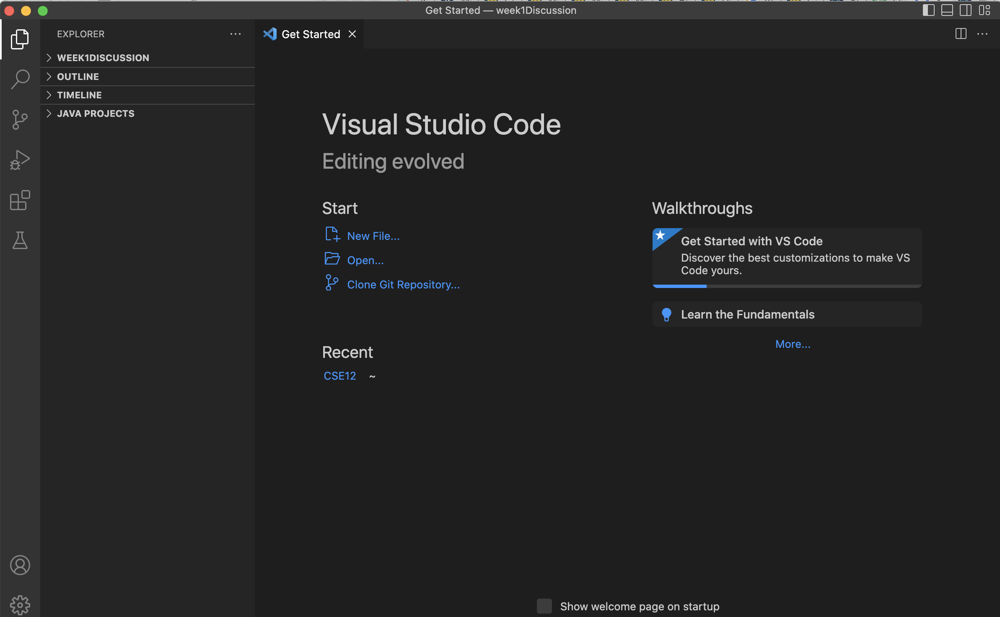
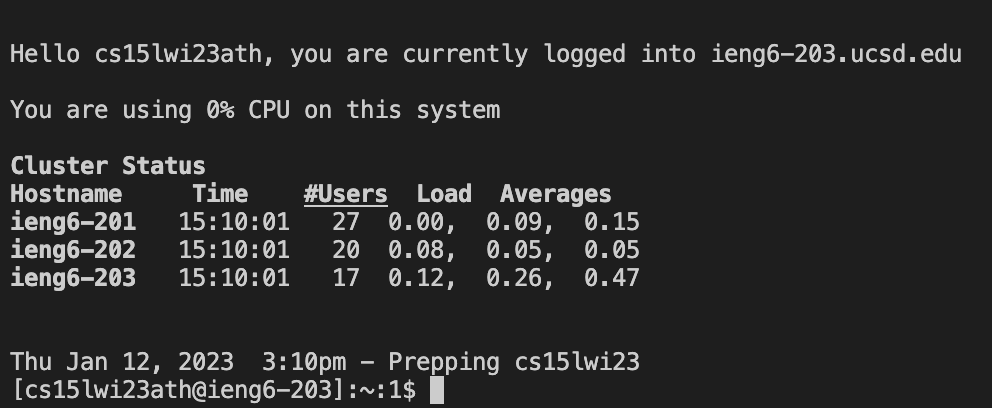
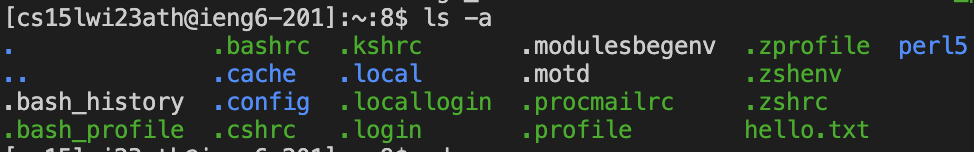

# Lab Report 1
## Course-Specific Account Login
1. Check your account for CSE15L by logging in your UCSD account username and ID here: 
[Link](https://sdacs.ucsd.edu/~icc/index.php)
2. Your account should be something starts with `cs15lwi23`
3. Clink on your account name and click change your password
4. Follow the Glocal Password Change Request (you can use your original password) 

## Installing VScode
1. Download and install the VScode through this link: 
[Link](https://code.visualstudio.com/)
2. Open VScode, you should see something like this

    
    
## Remotely Connecting
1. After downloading VScode, open the terminal: Terminal --> New Terminal
2. Type the following command in the termianl, replace `xx` with the letters in your CSE15L account

    `ssh cs15lwi23xx@ieng6.ucsd.edu`
3. Enter the password you reset after logging in to your CSE15L account (you won't be able to see what you are typing due to security issue) 
4. You should see something like this

    
    
## Trying Some Commands 
1. After remotely connected, try some commands in the terminal on your computer. 
2. Here are some examples: `cd` `ls -lat` `ls -a` `cp /home/linux/ieng6/cs15lwi23/public/hello.txt ~/`
3. Here are some results that you might see:
    * For `ls -a`
      
    
        
